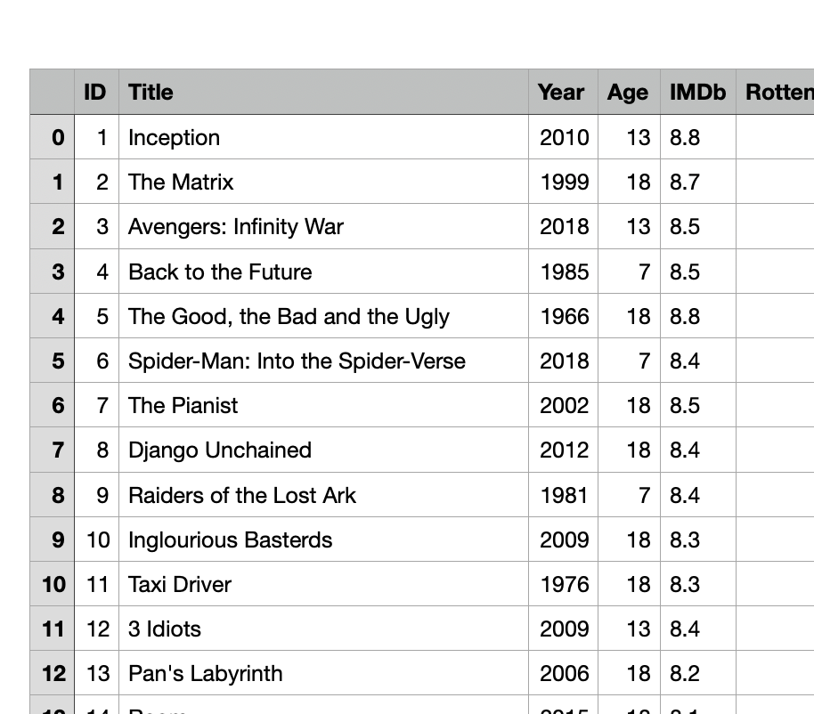

# Explication du projet

## Premières idées de projet 💡

### Quelle cible Apple devrait-il prioriser pour vendre plus de produits ?

Pour répondre à cette problèmatique, j'aurai voulu analyser à quelle période de leurs vies les utilisateurs d'Apple achètes le plus de produits de la marque.

Pour cette problèmatique j'ai eu des soucis de données. Il était impossible, même après plusieurs recherches, de trouver une **opendata** ou une **API** sur le sujet.

J'ai à la limite trouvé l'[API](https://developer.apple.com/app-store-connect/api/) d'Apple Store, mais qui ne permettait pas d'effectuer les actions que j'avais envie d'exécuter.

J'ai donc changé de sujet 🥲

### À quelle heure est-il préférable de prendre son train ?

J'avais envie de m'amuser un peu avec l'[API](https://www.digital.sncf.com/startup/api) de la SNCF. Donc, pour répondre à cette problèmatique, je voulais **étudier les retards** de la SNCF en fonction des heures de la journée, du jour de la semaine, etc.

À partir de mes statistiques, j'aurai pu proposer des horaires pour prendre son train en fonction du jour où il y a le moins de retard / d'annulation.

Mais un élève de la classe travaillait déjà sur la SNCF, j'ai donc changé de sujet 🤯

### Twitter est-il bien modéré ?

Pour répondre à cette nouvelle problèmatique, j'aurai voulu utiliser l'[API](https://developer.twitter.com/en/docs) de Twitter qui m'aurait permis de récupéré tout le flux de Tweets. Avec ces derniers, j'aurai voulu étudier tous les mots que je trouve et déterminer si ils sont pour moi "Injurieux" ou commun.

Pour ce faire, j'aurai utilisé une **wordlist** des injures que j'aurai pu facilement trouver sur Internet.

J'ai donc pour commencé fait la demande à Twitter pour utiliser leur [API](https://developer.twitter.com/en/docs). Ils ont été très réactif, mais ils m'ont tout de suite répondu que ce projet violé certains de leurs termes d'utilisation.

Je ne pouvais donc pas utiliser leur [API](https://developer.twitter.com/en/docs) pour ce projet.

J'ai donc encore dû trouver un autre sujet 🥲

## Mon projet final ✅

Finalement, mon projet sera d'étudier des statistiques sur les platformes de streaming afin de déterminer quelle platforme choisir.

## Récupération des données 📚

J'ai tout d'abord été amené à trouver une **opendata** pour ma problèmatique :

> Quelle platforme de streaming choisir entre Netflix, Hulu, Prime Video et Disney+ ❓

Après quelques recherches, j'ai trouvé une [base de donnée](https://www.kaggle.com/ruchi798/movies-on-netflix-prime-video-hulu-and-disney) intéréssante sur **16744** films et séries différents. Tous présent sur des platformes de streaming en ligne.

Afin de connaître le nombre d'occurence, j'ai exécuté dans l'invite de commande :

```bash
cat streaming-platforms.csv | wc -l
> 16744
```

## Utilisation de REGEX 🤓

J'ai utilisé les expressions régulières afin de supprimer une colonne vide inutile sur le fichier **csv**.

Je voulais supprimer la **première colonne de gauche** :



J'ai donc exécuté cette commande dans le terminal :

```bash
cat streaming-platforms.csv | sed -r "s/^[0-9]{0,10},//g" > new-streaming-platforms.csv
```

## CSV ➡️ JSON

Pour analyser mes données, je préfère utiliser un fichier **json** pour le filtrer en **JavaScript** qu'un fichier **csv**.

Avant toute chose, j'ai renommé le **header** du fichier **csv** pour faciliter l'utilisation en **json**.

J'ai donc développé un petit script en **Python** pour convertir mon fichier **csv** en fichier **json**.

Je suis maintenant près à analyser mes données 🤓

## Pour exectuer le site 📊

Il faut lancer le site sur un **locahost** pour l'exectuer ! Sinon, les requête en back ne pourront pas se faire.

---

[Sami Lafrance](https://samilafrance.com)